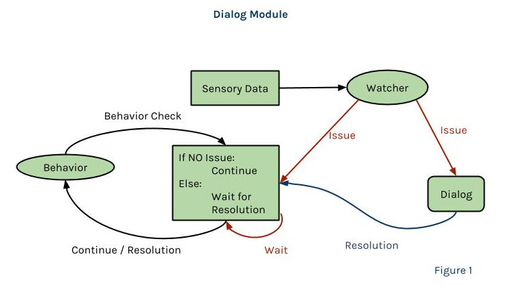
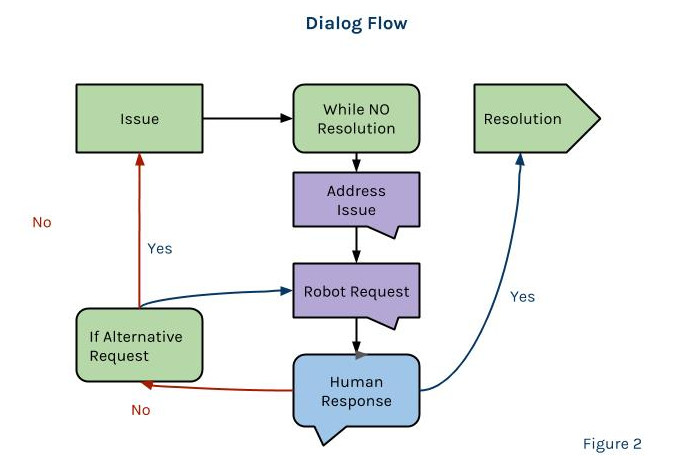

# Dialogue Module Documentation and Background

The central idea behind the the Dialogue Module is to have a system where robots can identify problems and then engage in a dialog with their human teammate to resolve the problem. This additional functionality is an extension of Janelle’s Distributed Multi-Robot Architecture. The rest of this documentation will be divided as such: architecture design, current state, and what’s next. NOTE: the next two sections will have to be updated as more is done.

## Architecture Design

Figure 1 show the overall flow of the architecture. The Watcher in the dialog module uses sensory data to determine when an issue arises. An issue message is then published to the dialog (in the code it should be found under `chatter.py`).

Figure 2 illustrates the dialog flow in chatter.py. This architecture should make it so it’s easy to create more responses for the robot. When a resolution message is sent the robot will need a corresponding method for how to deal with the action. For example, if the robot can’t find an object and the human decides to fetch the object for the robot, then the robot will need to try to pick up the object again.

## Current State

This method works in simulation. There is a shell script `ros_sim.sh` that should run a very crude simulation of the current architecture. You may need to adjust the name of your workspace so it corresponds to the name of your actual workspace. From here you should be able to test the architecture capabilities to deal with unexpected situations.

* Dropping objects: When the robot is holding an object call the `/drop` service.
* Hide objects: to test objects missing edit the `table_sim_node.cc` the populate state method. There should be an if-else statement determining whether an object is “visible”
* Objects out of reach will start the dialog automatically.
* Objects that need more precise handling need to be listed in dialogue/scripts/watcher.py:~45 positionCheck method’s objects list. The rationale was that not all objects need help. This could be an extension of the work where the robots learn in different tasks which objects they need help with and which ones they don’t, instead of being hard coded in.

### Simulator Notes

The following colors correspond to the following objects in the simulator:
* Pink -> clock
* Cyan -> teddy_bear
* Yellow -> scissors
* Red -> cup
* Green -> apple
* Navy Blue -> PR2
* Dark Green -> Baxter (NOTE: was not able to get dialog working for both robots but not necessary for validation)

## What’s Next
* Integrating the stop function into the architecture and testing it in simulation.
* Adding the voice commands to chatter.py (Natalie)
* Getting the active vision system integrated into the architecture (Dave and Janelle)
* Once vision is working, interpreting data so that watcher.py can start publishing issue msgs.
* Use arm camera to identify is something is being held. If not then an issue message should be published.
* Get maximum reach of robot so it know when to publish that an object is unreachable. (Janelle)
* Possibly add if GPD can’t find a grasp point for an object, making an object ungraspable.
* Adjusting the architecture so that you can ‘undo’ actions (Bashira)
* Adjusting the architecture so human actions can be taken into account. For example if a human picks and places an object, the robot should be able to say that the task is complete even though it did not Pick then place. (Dave & Bashira)
* Validation: Build the Eket stand. However, remove one piece from the table to start, put one piece out of reach, and force the robot to drop a piece (either by forcing it or making some kind of service call where it drops).
